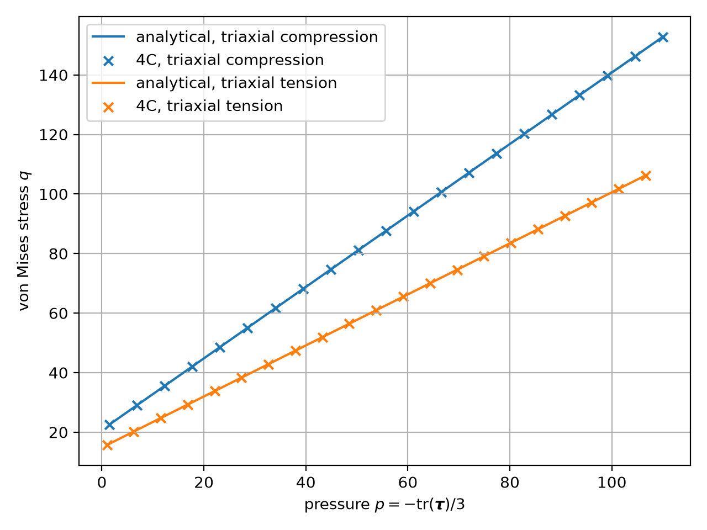

Mohr-Coulomb material
=====================

``MAT_Struct_MohrCoulomb`` is a finite-strain isotropic elastoplastic material. It uses the
principal elastic logarithmic (Hencky) strains and their work-conjugate Kirchhoff stresses.
The multiplicative history variable is the inverse plastic right Cauchy-Green tensor.

Yield surface and flow rule
---------------------------

For ordered principal Kirchhoff stresses
:math:`\tau_1 \geq \tau_2 \geq \tau_3`, the active Mohr-Coulomb plane is

.. math::

   f = k\tau_1-\tau_3-2\sqrt{k}\,c(\bar{\varepsilon}^{p}) \leq 0,
   \qquad
   k=\frac{1+\sin\phi}{1-\sin\phi}.

The plastic potential has the same form with
:math:`m=(1+\sin\psi)/(1-\sin\psi)`, where :math:`\psi` is the dilatancy angle.
Setting ``DILATANCY_ANGLE`` equal to ``FRICTION_ANGLE`` gives associative plasticity.
The return mapping works directly with active planes in principal stress space and treats a
smooth face, both triaxial edges, and the hydrostatic apex separately.

The cohesion hardening law combines linear and Voce terms:

.. math::

   c(\bar{\varepsilon}^{p}) =
   c_0 + H\bar{\varepsilon}^{p}
   + (c_\infty-c_0)\left(1-\exp(-b\bar{\varepsilon}^{p})\right).

Set ``SATURATION_HARDENING`` to zero to disable the Voce term.

Input
-----

.. code-block:: yaml

   MAT_Struct_MohrCoulomb:
     YOUNG_MODULUS: 1.0e5
     POISSON_RATIO: 0.3
     DENSITY: 2200
     COHESION: 100
     FRICTION_ANGLE: 0.5235987755982
     DILATANCY_ANGLE: 0.4363323129986
     LINEAR_HARDENING: 0
     SATURATION_HARDENING: 500
     HARDENING_EXP: 10
     TOLERANCE: 1.0e-10
     MAX_ITERATIONS: 100

The material requires ``KINEM: nonlinear``. Angles are specified in radians. The dilatancy
angle must be strictly positive and must not exceed the friction angle; a zero dilatancy angle
does not provide an admissible hydrostatic apex flow direction.

Output
------

The material registers ``plastic_strain``, ``accumulated_plastic_strain``,
``accumulated_plastic_volumetric_strain``, and ``local_dissipated_energy`` as Gauss-point
output quantities.

Verification
------------

The calculated triaxial-compression and triaxial-tension meridians coincide with the analytical
Mohr-Coulomb yield surface:

The constitutive tests also cover elastic response, associative and non-associated flow,
linear and Voce hardening, both edges, the apex, the consistent smooth-face tangent, output
variables, and serialization.

The return algorithm follows Clausen, Damkilde, and Andersen,
*Efficient return algorithms for associated plasticity with multiple yield planes*,
Computers & Structures 85 (2007), doi:10.1016/j.compstruc.2007.04.002.
