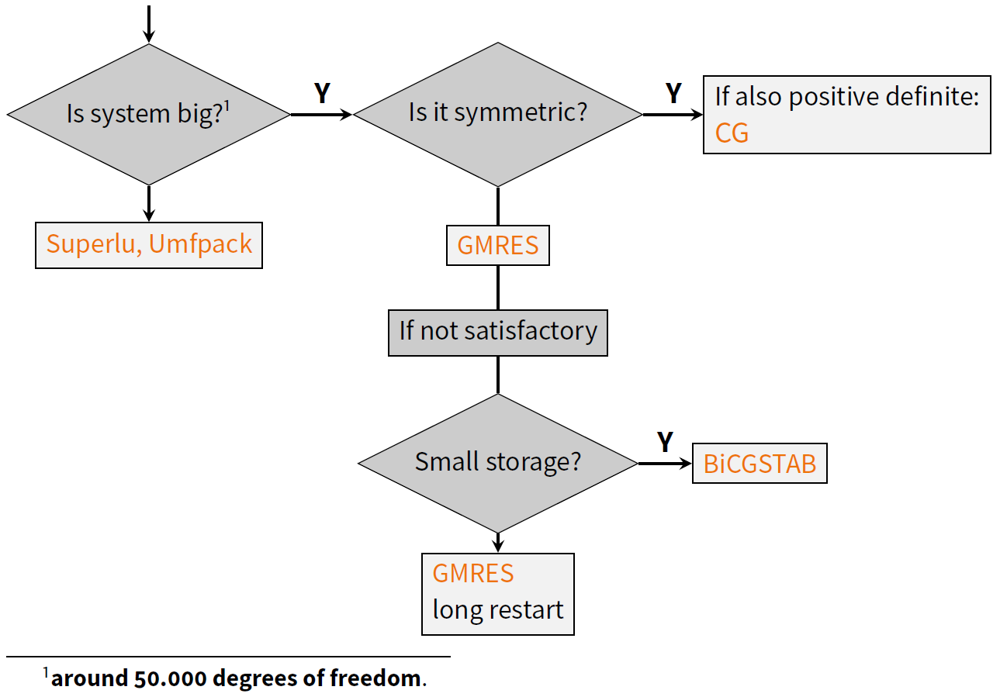

Linear solver
================

The heart of a finite element solver is the linear solver,
since all equations used to describe the behavior of a structure are finally collected in a single matrix equation of the form

.. math::

    \mathbf{A} x =  b

where the vector :math:`x` is to be calculated based on a known matrix :math:`\mathbf{A}` and the vector :math:`b`.
Two numerical methods exist in general to solve this equation.

* Direct solver
* Iterative solver

It is very important to understand that a direct solver simply solves the equation without consideration of the nature of the system,
while physics plays a role in iterative methods, and particular, their multigrid preconditioners (see below),
so it is important for the latter to comprehend the parameters to be used.
Anyway, the decision on which solver to use is illustrated in the following flow chart:

   Flowchart of the decision process for an appropriate linear solver, taken from a presentation held by Max Firmbach in 2022.

At this point, the linear algebra library *Trilinos* is heavily used, which provides a number of packages on different levels:

**Epetra/TPetra**:
   Sparse Linear Algebra

**Amesos/Amesos2**:
   Direct Solvers (internal solver KLU/KLU2, external solvers UMFPACK, Superlu)

**Belos**:
   Iterative Solvers (CG, GMRES)

**Ifpack**:
   Preconditioner (ILU)

**MueLu**:
   Algebraic Multigrid-Preconditioner

**Teko**:
    Block Preconditioner

The solvers are called in the solver sections::

   -----------SOLVER 1
   NAME    <arbitrary_name>
   SOLVER  <solver>
   ...
   -----------SOLVER 9

in which all details for a specific solver are defined.
The parameter ``SOLVER`` defines the solver to be used.
Most of the solvers require additional parameters. These are explained in the following.

Solvers for coupled problems (aka multiphysics)
-------------------------------------------------

Sequential solution:
^^^^^^^^^^^^^^^^^^^^^

If a :ref:`multiphysics problem <multifieldproblems>` is to be solved,
each physics involved can be solved one after the other, and the interaction then leads to an iterative procedure,
where the influence of one field to the other hopefully converges to a common solution.
From a solver's point of view, the solution is achieved by running the solver of each single field problem independent of others.
Therefore, those problems are solved like single *physics* problems using the methods given below.
One solver has to be defined for each *physics*, but the definition in the input file can be one for several solvers.

For example, a structural analysis sequentially coupled with scalar transport needs two solvers, handling the respective physics:

::

    ------------------------------------------------------PROBLEM TYPE
    PROBLEMTYPE                      Structure_Scalar_Interaction
    ------------------------------------------------STRUCTURAL DYNAMIC
    LINEAR_SOLVER                   1
    ...
    ------------------------------------------SCALAR TRANSPORT DYNAMIC
    LINEAR_SOLVER                   2
    ...
    ----------------------------------------------------------SOLVER 1
    SOLVER                          UMFPACK
    ----------------------------------------------------------SOLVER 2
    SOLVER                          UMFPACK

For the case above, actually, one could also use ``SOLVER 1`` for both physics, two solvers of the same kind would then still be used.

Monolithic solution:
^^^^^^^^^^^^^^^^^^^^^

If, on the other hand, the interaction of the physical fields is strong, the iterative procedure may converge only slowly (if at all),
thus a so-called *monolithic solution*, solving all degrees of freedom simultaneously is beneficial.
This solution type will be described in the following:

The degrees of freedom of all physics appear in the linear system.
Since the stiffness factors of the different physics may be different by orders of magnitude,
and the coupling between the physics may again have a different magnitude,
the linear system may be particularly ill-conditioned.

For the monolithic solution of the multiphysics problem, an additional solver is needed for the monolithic approach,
e.g., again for the SSI problem:

::

     ------------------------------------------------------PROBLEM TYPE
     PROBLEMTYPE                      Structure_Scalar_Interaction
     ------------------------------------------------STRUCTURAL DYNAMIC
     LINEAR_SOLVER                   1
     ...
     ------------------------------------------SCALAR TRANSPORT DYNAMIC
     LINEAR_SOLVER                   1
     ...
     --------------------------------------------SSI CONTROL/MONOLITHIC
     LINEAR_SOLVER                   2
     ----------------------------------------------------------SOLVER 1
     SOLVER                          UMFPACK
     ----------------------------------------------------------SOLVER 2
     SOLVER                          Belos
     AZPREC                          AMGnxn
     AMGNXN_TYPE                     XML
     AMGNXN_XML_FILE                 ssi_mono_3D_27hex8_scatra_BGS-AMG_2x2.xml

Here, we have used the same solver type (a direct solver) for each physics, and for the coupling we used an iterative solver (Belos).
The situation is similar, when fluid-structure or thermo-structure coupling is employed.
The iterative solver used for the coupling is particularly suited for this kind of mathematics, where the coupled degrees of freedom are given in a so-called block structure.
The solver settings are explained in detail below.

Special case: Contact
^^^^^^^^^^^^^^^^^^^^^^^

Even though contact does not involve several physics directly, they can be treated as a coupled problem:

- Contact with penalty: basically still solid mechanics (probably a bit more ill-conditioned)
- Contact with lagrange multipliers: There is a block structure in the system.
  If an iterative solver is used, the preconditioner needs to know about it.

Solver Interfaces
-------------------

Direct solver
^^^^^^^^^^^^^^

In principle, the direct solver identifies :math:`x` by calculating the inverse of :math:`\mathbf{A}`: :math:`x = \mathbf{A}^{-1} b`.

In |FOURC|, we have three different direct solvers included:

   * UMFPACK, using a multifront approach, thus a sequential solver (can only use a single core)
   * SuperLU, an MPI based solver, which may run on many cores and compute nodes.

Compared to iterative solvers, these solvers do not scale well with the numbers of equations,
and are therefore not well suited for large systems.
If one has to solve a system with more than 50000 degrees of freedom (approx. equal to number of equations),
the iterative solver will be significantly faster.
In addition, the iterative solver is more memory efficient, so it can solve larger system with a computer equipped with low memory.

The benefit of the direct solver is that there are no parameters, which one has to provide,
since the direct solver does not care about the underlying physics. The definition in the input file is simply

::

     ----------------------------------------------------------SOLVER 1
     SOLVER                          UMFPACK

Iterative solver
^^^^^^^^^^^^^^^^^^

The iterative solver can be used for any size of equation systems, but is the more efficient the larger the problem is.
If a good parameter set for the solver is chosen, it scales linearly with the size of the system,
either with respect to time or to the number of cores on which the system is solved.

The main drawback is that one has to provide a number of parameters, which are crucial for a fast and correct solution.

Contrary to the direct solver, the matrix inverse is not needed.
Instead, this solution method solves the equation :math:`\mathbf{A} x_k = b`  with an initial guess :math:`x_0 (k=0)` and an iteration

.. math::

   x_{k+1} = \mathbf{P}(x_k, \mathbf{A} x_k, b) \, ,

such that :math:`x_k \rightarrow x \mbox{ for } k \rightarrow \infty`.
Slow progress if :math:`x_0` is not chosen properly. A preconditioner helps by solving
:math:`\mathbf{P}^{-1} \mathbf{A} x = \mathbf{P}^{-1} b`.
Ideally :math:`\mathbf{P}^{-1} = \mathbf{A}` (gives the solution for *x*),
but :math:`\mathbf{P}` should be cheap to calculate.
The larger the problem is, the higher is the benefit of iterative solvers.

The current solver is based on Trilinos' **Belos** package, which is the successor of AztecOO.
This package provides a bunch of KRYLOV solvers, e.g.

   - CG (conjugate gradient method) for symmetric problems,
   - GMRES (Generalised Minimal Residual Method, also for unsymmetric problems)
   - BICGSTAB (Biconjugate gradient stabilized method)

Originally, the parameters have been defined in the solver sections; however, this is deprecated now.
In order to narrow down the size of the input file, all parameters for the iterative solver are now given in an extra xml File, which is included by the parameter
``SOLVER_XML_FILE``.
Thus, the solver section may also consist of

::

   -----------SOLVER 1
   SOLVER           Belos
   SOLVER_XML_FILE  gmres_template.xml
   ...

One can find a number of template solver xml files in ``<source-dir>/tests/input-files/xml/linear_solver/*.xml``.
Further parameter are necessary for the preconditioner, where a number of choices are available, see below.

Preconditioners
^^^^^^^^^^^^^^^^

The choice and design of the preconditioner highly affect performance.
Within Belos one can choose between the following four preconditioners:

-	ILU
-	MueLu
-   Teko
-   AMGnxn

ILU is the easiest one to use with very few parameters; however, perfect scalability is not achieved with this method.
For better performance use **MueLu** for single physics and **Teko** or **AMGnxn** for multiphysics problems.
You'll find templates of parameter files for various problems in the subdirectories of ``<>source-dir>/tests/input-files/xml/...``.

The preconditioner is chosen by the parameter ``AZPREC`` within the ``SOLVER n`` section.
Note that the parameter to define the xml-file for further preconditioner-parameters is different for each preconditioner.
The solver sections appear in the following way:

::

   -----------SOLVER 1
   SOLVER           Belos
   SOLVER_XML_FILE  gmres_template.xml
   AZPREC           ILU
   IFPACK_XML_FILE <path/to/your/ifpack_parameters.xml>
   -----------SOLVER 2
   SOLVER           Belos
   NAME             algebraic_multigrid_solver
   SOLVER_XML_FILE  gmres_template.xml
   AZPREC           MueLu
   MUELU_XML_FILE  <path/to/your/multigrid_parameters.xml>
   -----------SOLVER 3
   SOLVER           Belos
   NAME             block_multigrid_solver
   SOLVER_XML_FILE  gmres_template.xml
   AZPREC           Teko
   TEKO_XML_FILE   <path/to/your/block_preconditioner_parameters.xml>
   -----------SOLVER 4
   SOLVER           Belos
   NAME             block_multigrid_solver
   SOLVER_XML_FILE  gmres_template.xml
   AZPREC           AMGnxn
   AMGNXN_TYPE      XML
   AMGNXN_XML_FILE  <source-dir>/tests/input-files/*_AMG_*.xml

The xml files are named after problem types for which they are most suited.
It is highly recommended to first use these defaults before tweaking the parameters.

ILU (incomplete LU method) comes with a single parameter, therefore only a single xml file is contained in the respective directory:
``<>source-dir>/tests/input-files/xml/preconditioner/ifpack.xml``.
In this file, the so-called fill level is set up by ``fact: level-of-fill``, and it contains the default value 0 there.
With lower values, the setup will be faster, but the approximation is worse.
The higher the more elements are included, sparcity decreases (a level of 12 might be a full matrix, like a direct solver).

The current recommendation is to use one of the three more sophisticated preconditioners currently available.
All these preconditioners have a number of parameters that can be chosen;
however, a recommended set of parameters for various problems are given in respective xml files.

In general, the xml file for the multigrid preconditioners usually contains the divisions

- general
- aggregation
- smoothing
- repartitioning

For preconditioning of large systems, the trick is to apply a cheap transfer method to get from the complete system to a smaller one (coarsening/aggregation of the system).
Here, coarsening means the generation of a smaller system size, will aggregation is the reverse procedure to come to the original matrix size.
The coarsening reduces the size by comprised a number of lines into one; common choices are 27 for 3D, 9 for 2D, and 3 for 1D problems, which is conducted by default.

The overall multigrid algorithm is defined in the general section by ``multigrid algorithm``, which can have the values
``sa`` (Classic smoothed aggregation, default), ``pg`` (prolongator smoothing) among others.

A smoother is used twice (pre- and post-smoother) for each level of aggregation to reduce the error frequencies in your solution vector.
Multiple transfer operations are applied in sequence, since only high frequency components can be tackled by smoothing,
while the low frequency errors are still there.
The restriction operator restricts the current error to the coarser grid.
At some point (let say if 10000 dofs are left) the system has a size where one can apply the direct solver.
This number is given by ``coarse:: max size`` in the general section of the xml file.
That is, when the number of remaining dofs is smaller than the given size, no more coarsening is conducted.
It should be larger than the default of 1000, let say, 5000-10000.
Also, the maximum number of coarsenings is given by ``max levels``. This number should always be high enough to get down to the max size, the default is 10.

After reaching the coarsest level, the remaining system is solved by a (direct) solver.
The parameter to setup the direct solver is ``coarse: type``,
and it can have the values ``SuperLU`` (default), ``SuplerLU_dist`` (the parallel version of SuperLU), ``KLU`` (an internal direct solver in trilinos) or ``Umfpack``.
(After changing to Amesos2, the internal server will be KLU2).

The smoother to be used is set up by ``smoother: type`` with the possible values ``CHEBYSHEV``, ``RELAXATION`` (default), ``ILUT``, or ``RILUK``
While many solvers can be used, five of them are most popular: SGS (symmetric Gauss Seidel), Jacobi, Chebyshev, ILU, MLS.
Besides that, particularly for the coarsest smoother, a direct solver can be used, as (Umfpack, SuperLU, KLU).

*Chebyshev smoother:*
   This is a polynomial smoother. The degree of the polynomial is given by `smoother: sweeps` (default is 2).
   A lower degree is faster (not much), but higher is more accurate; reasonable values may go up to 9 (very high)

*Relaxation method:*
   The relaxation smoother comes with a number of additional parameters inside a special section , particularly the type: ``relaxation: type``,
   which can be ``Jacobi``, ``Gauss-Seidel``, ``Symmetric Gauss-Seidel`` among others. The polynomial degree can be setup here by ``relaxation: sweeps``.
   This one is rather for fluid dynamics problems.

*ILUT, RILUK:*
   These are local (processor-based) incomplete factorization methods.

For understanding the multigrid preconditioner better, the interested reader is referred to a :download:`presentation held by Max Firmbach in 2022 <figures/TGM_LinearSolvers.pdf>`.

Damping helps with convergence, and it can be applied to any of the smoothers by ``smoother: damping factor``.
A value of 1 (default) cancels damping, 0 means maximum damping.
Too much damping increases the iterations, thus, usually it should be between 1 and 0.5.
A little bit of damping will probably improve convergence (also from the beginning).

For the multigrid preconditioner, one can also find a :download:`comprehensive documentation <https://trilinos.github.io/pdfs/mueluguide.pdf>`
on the trilinos website, explaining all the parameters, their meaning and the default values.

.. list-table::
   :header-rows: 1

   * - Problem
     - Symmetry
   * - Convection dominated flow
     - nonsymm
   * - elasticity
     - symm
   * - Contact
     - unsymm

